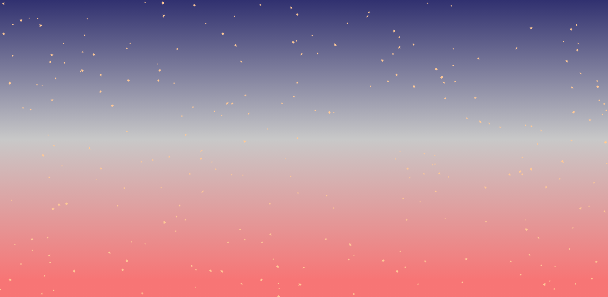

# EasyDraw.js

    html5 canvas 를 쉽게 사용하기 위한 간단한 라이브러리

    절대 좌표를 사용해야하는 canvas 가 불편해서
    현재 위치를 기준으로 상대 위치를 기술할 수 있게 했다.

---

## 사용 방법

EasyDraw.js 만 필요

## 멤버변수

- x
- y
- angle

현재 나의 위치(x, y), 내가 향하고 있는 방향 (angle)

## 메서드

- moveTo (x, y)
- moveForward (distance)
- lineForward (distance)
- drawLine (distance)
- rotate (angle)
- lookCurPos (length)

  - 디버깅 용도. 현재 위치를 red로 표시.

---

 

### 위 라이브러리로 그린 것. example

